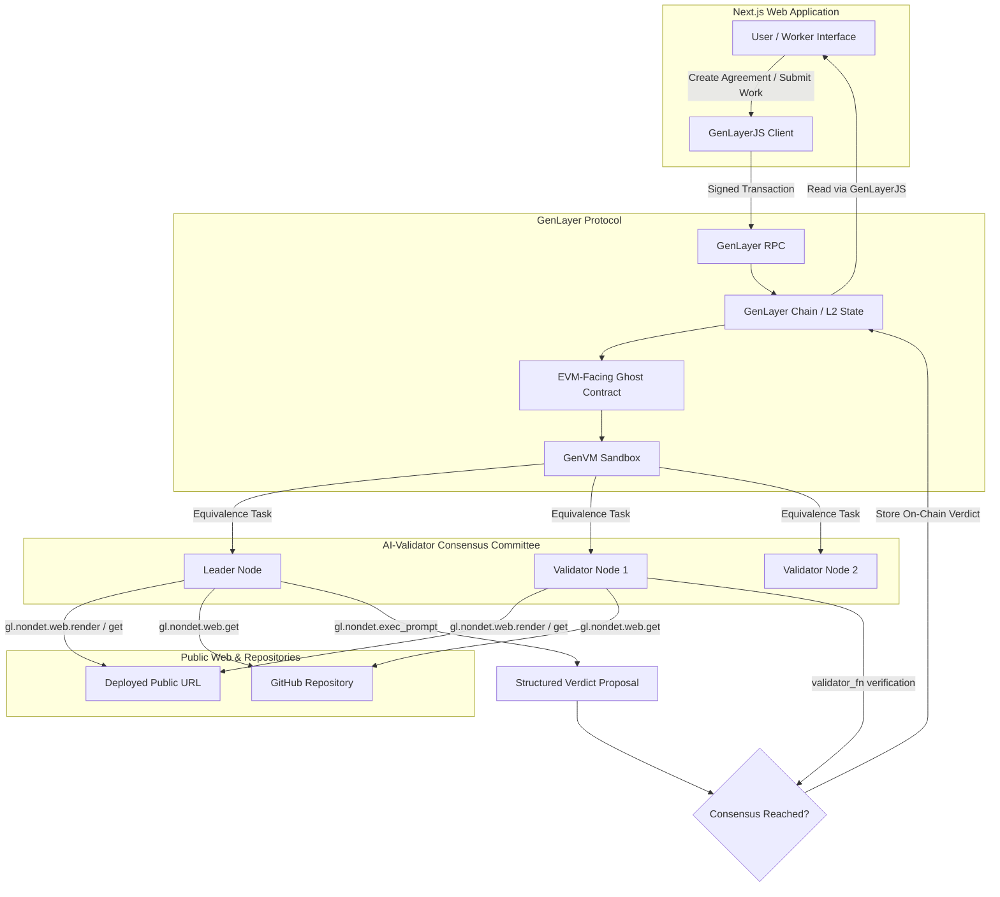

# ProofJudge Architecture

## Overview

**ProofJudge** provides trustless, on-chain verification of human-defined natural language work agreements using GenLayer's decentralized AI-validator consensus.

Traditional smart contracts cannot verify human-defined criteria (e.g., "Build a responsive 5-section landing page with working contact form and open-source code on GitHub"). Oracles and centralized backends reintroduce single points of failure, censorship, and trust assumptions. ProofJudge utilizes GenLayer's GenVM: validators independently inspect live web evidence and reach on-chain consensus on natural language requirement satisfaction.

---

## Component Breakdown

### 1. Intelligent Contract (`contracts/proof_judge.py`)
- Runtime: `py-genlayer` on GenVM.
- State:
  - `agreements`: Mapping of agreement ID to stored agreement dataclass.
  - `agreement_count`: Sequential counter of agreements created.
- Operations:
  - `create_agreement(title, description, requirements, deadline_hours)`: Initializes new agreement in `OPEN` state.
  - `submit_work(agreement_id, evidence_url, github_url, explanation)`: Worker registers evidence, transitions agreement to `SUBMITTED`.
  - `evaluate_submission(agreement_id)`: Triggers leader and validator consensus to fetch evidence and produce on-chain verdict (`APPROVED`, `REJECTED`, `INSUFFICIENT_EVIDENCE`).
  - `get_agreement(agreement_id)`: View method returning complete agreement state.
  - `get_verdict(agreement_id)`: View method returning finalized evaluation verdict.

### 2. Consensus & Equivalence Design
- Uses `gl.vm.run_nondet_unsafe(leader_fn, validator_fn)`.
- `leader_fn`:
  1. Retrieves public evidence URL via `gl.nondet.web.render` or `gl.nondet.web.get`.
  2. Retrieves GitHub source URL if provided.
  3. Prepares structured prompt isolating untrusted evidence in dedicated tags.
  4. Invokes `gl.nondet.exec_prompt(..., response_format='json')`.
  5. Parses JSON output into deterministic verdict record (`decision`, `criteria_met`, `criteria_total`, `summary`, `criteria_results`).
- `validator_fn`:
  1. Validates that leader return payload adheres to structural requirements and schema types (booleans).
  2. Independently validates evidence accessibility and criteria bounds.
  3. Ensures decision mathematically corresponds to criteria outcomes (e.g. `criteria_met == criteria_total` for `APPROVED`, all `met` are booleans).

### 3. Frontend Architecture (`frontend/`)
- Framework: Next.js (App Router), React, TypeScript, Tailwind CSS.
- Blockchain Layer: `genlayer-js` 1.1.8 with EIP-1193 browser wallet connection (MetaMask, Rabby, etc.) and direct read fallback for non-wallet users.
- Live RPC Support: Testnet Bradbury (`rpc-bradbury.genlayer.com`), Studionet (`studio.genlayer.com/api`), and Localnet (`localhost:4000/api`).
- Interactive Modules:
  - **Landing & Discovery**: Hero explaining trustless agreement verification with real GenLayer consensus details.
  - **Agreements Feed & Dashboard**: Filter by user role (Creator / Worker), status (`OPEN`, `SUBMITTED`, `FINALIZED`).
  - **Create Agreement Form**: Multi-criteria builder with dynamic requirement items and deadline picker.
  - **Agreement Detail & Submission**: Evidence submission form with URL checks and explanation.
  - **Verdict Panel**: Real-time evaluation status, criteria breakdown checklist, validator consensus metadata, and transaction link.
